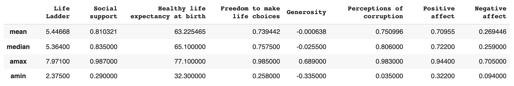
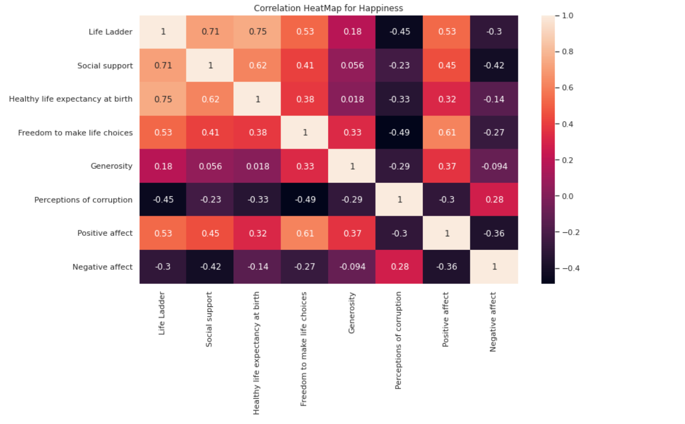
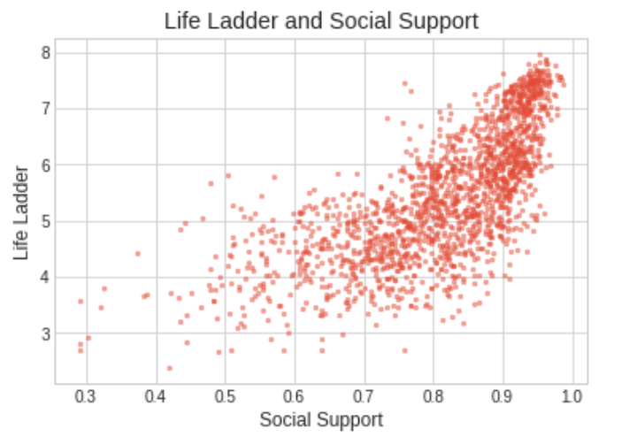
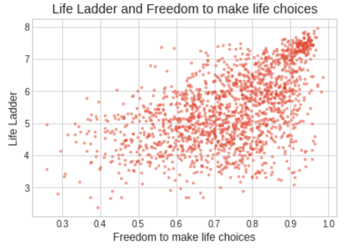
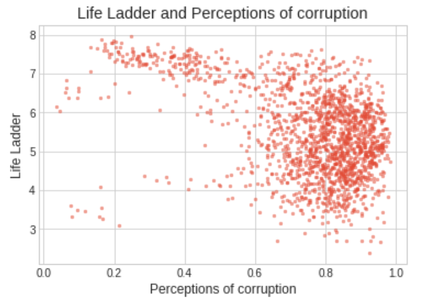

-   [Introduction](#introduction)
-   [Data Organization](#data-organization)
-   [Exploratory Data Analysis](#exploratory-data-analysis)
    -   [Summary Statistics](#summary-statistics)
    -   [Correlation Heatmap](#top-10-states-by-number-of-accidents)
    -   [Scatterplots](#scatterplots)
-   [Conclusions](#conclusions)
    -   [Main Observations](#main-observations)
    -   [Future Directions](#future-directions)
-   [Run Notebook in Google Colab](#run-notebook-in-google-colab)
-   [Youtube Video Link](#youtube-video-link)
-   [Assertion-Evidence Presentation Link](#Assertion-evidence-presentation-link)
-   [Inquiries](#inquiries)
-   [Data Sources](#data-sources)
-   [Acknowledgments](#acknowledgments)

# Introduction
**An Analysis of What Contributes to World Happiness**

The COVID-19 pandemic has brought to light just how important happiness and mental health is in our lives. During times of lockdown, many individuals found themselves struggling with mental health issues and craving the things and activities that bring us most joy. In other words, the pandemic highlighted just how important being happy is for our mental health and forced us to reflect on the specific elements of our lives that bring us happiness.

Everyone wants to live the happiest life they can. For some, social support may be the most important aspect of being happy. For others, happiness may stem from economic success, helping others, or having the freedom and opportunity to do what they wish. Through the data science process, our group will try and decipher what elements foster happiness on a global scale. In other words, we will try to answer the following question: **What are the most influential factors in one’s life to being happy?**

Our analysis has the potential to provide valuable and actionable insights for policymakers and law-makers, whose ultimate goal is to create and implement policies that will best benefit society. In the unprecedented times we have been living in with the pandemic, being happy and having good mental health has never been so important. Our analysis can hopefully shed some light as to whether social networks, financial success, or some other factor may impact happiness the most, which policymakers can use to inspire practices that are most likely to foster happiness among society at large.

# Data Organization
In order to gain insight into what factors most influence one’s happiness, we will use a dataset provided by the United Nations entitled World Happiness. The UN reports world happiness data on a yearly basis. This is the most recent dataset on the subject. 

The UN uses data collected from the Gallup World Poll, which surveys individuals on main life evaluation questions. The Gallup World Poll  is conducted yearly in at least 153 countries with a random sample of at least 1000 respondents in each country. Participants of the survey were asked how a number of different factors, such as social support and freedom to make life choices, impacted the overall happiness in their lives from 0 to 10, with 10 being the best possible life and 0 being the worst. They are also asked to rate their overall happiness level in their lives, on this same 0 to 10 scale. Other varriables in the dataset were binary survey questions, so respondents answered with either a 0 or 1. The values for these variables are averaged for each country and year. The data collected is based entirely on the survey scores, using the Gallup weights to make the estimates representative. 

After our data manipulation and subsetting processes, we ended up with the following data frame:

Attribute | Data Type | Description |
--- | --- | --- 
Life Ladder | Ratio | Describes respondents overall life happiness on a scale of 0-10
Social Support | Ratio | Describes the national average of the binary responses (either 0 or 1) to the question   “If you were in trouble, do you have relatives or friends you can count on to help you whenever you need them, or not?”
Healthy Life Expextancy at Birth | Ratio | The time series of healthy life expectancy at birth constructed based on data from the World Health Organization (WHO)   Global Health Observatory data repository, with data available for 2005, 2010, 2015, and 2016. 
Freedom to Make Life Choices | Ratio | National average of binary responses to the GWP question “Are you satisfied or dissatisfied with your freedom to choose   what you do with your life?”
Generosity | Ratio | Describes the residual of regressing the national average of GWP responses to the question “Have you donated money to a   charity in the past month?” on GDP per capita.
Perceptions of Corruption | Ratio | Describes the average of binary answers to two GWP questions: “Is corruption widespread throughout the government or not?”   and “Is corruption widespread within businesses or not?” Where data for government corruption are missing, the perception of   business corruption is used as the overall corruption-perception measure.
Positive affect | Ratio | Desrcibes the average of previous-day affect measures for happiness, laughter, and enjoyment for years 2008 to 2012, and some in 2013
Negative affect | Ratio | Decribes the average of previous-day affect measures for worry, sadness, and anger for all years.

# Exploratory Data Analysis
Here we present some of our findings during our exploratory data analysis process. For the complete EDA, please refer to [our Colab notebook](.....)

## Summary Statistics
Below we present the max, min, median, and mean values for our updated data frame.

    

One thing to note from the summary statistics presented above is the mean value of 5.44668 on the 'Life Ladder' variable. This variable relfects respondents overall life happiness level on a scale from 0-10. A mean value of roughly 5.45 tells us that on average, survey respondents are only somewhat happy in their daily lives. We expected this number to be slightly higher. This gives us even more reason to conduct analysis on what contributes the most to this variable. Our goal is to provide actionable insight for policymakers to help them design and implement regulations that are most likely to foster a happy society.

## Correlation Heatmap
Creating a correlation heatmap allowed us to get a baseline idea of which variables in our data frame may most contribute to life happiness. The correlation heatmap is presented below:

    

## Scatterplots
We created scatterplots for the variables that showed strongest correlations to our predictor variable of 'Life Ladder'. In our full notebook, you can see all five scatterplots created. Here are a few noteable scatterplots:

    

    

    

# Conclusions
Our original goal of this project, in light of the global crisis bringing much disparity to the world, was to highlight certain aspects of someone's life that contribute to their overall happiness. In doing so we hoped to find patterns in the dataset we analyzed, finding relationships between our independent variables and how they relate to one's overall happiness scale. We can then use our findings to improve the lives of many. From our results we came to these conclusions:

## Main Observations
Initially, we investigated the relationships between happiness level, and the chosen predictor variables of happiness, by analyzing scatter plots of the data from each predictor variable relating to happiness. In addition we tested the correlation value for each variable and happiness. Based on our EDA, we can see that the most highly correlated variable with life happiness is healthy life expectancy at birth. Meaning that when someone is born, the longer they are expected to live is positively associated with their happiness as they are older. An additional highly positively correlated variable was social support and freedom to make life choices. Finally, our analysis from both the logistic regression trained model and the EDA confirm perceptions of corruption is a significant predictor of happiness, and overall a negative one. Overall, most variables in our data frame were influential in predicting happiness levels, with social support, freedom to make life choices, and healthy life expectancy as positively impact happiness, and perceptions of corruption as negatively impacting happiness.

## Future Directions
From our analysis, there are a few recommendations we could provide to policymakers for them to foster feelings of happiness among society. Healthy life expectancy is a strong contributor to overall happiness levels. Some actions that could be taken here would be ways to increase life expectancy. For example, promoting healthy lifestyle choices: Practicing a proper diet, exercising, making smarter decisions and being less risky in certain situations. Not only this though, but actual spending could be done. For example, increasing government spending for health care or making health care more easily accessible to the public are huge ways to help increase life expectancy. One last way to improve could be to invest in medicine. Making advancements in that field would also greatly benefit life expectancy. As society develops, so would life expectancy.

With social support being another strong contributing factor to life expectancy, policy makers could try to implement programs that are centered around community engagement as much as possible. Increasing community relationships and social connections would be beneficial in fostering an overall sense of happiness among community members.

Lastly, with perceptions of corruption negatively impacting happiness levels, we can recommend that policymakers maintain a transparent relationship with the communities they govern. Especially during the pandemic with hoards of different information and a new level of trust instilled in the government with the creation and distribution of the Covid vaccine, it’s important to maintain transparency. Maintaining a transparent and open relationship between community and government should help foster the largest sense of happiness among the community.

# Run Notebook in Google Colab

Click the link below to run [our notebook](...) directly in Google Collab. No coding is required to run this notebook, you just need to run every code cell in order or simply click Runtime -> Run all and wait for all cells to run.

<table align="left">
  <td>
    <a target="_blank" href="...">Run in Google Colab</a>
  </td>
</table>
     

# Youtube Video Link
Check out our walkthrough video [here](...)!

# Assertion-Evidence Presentation Link
Check out our presentation [here](...)!

# Inquiries
For inquiries about this project, please contact Michael Berkowitz at <a href="mailto:berkowml@lafayette.edu">berkowml@lafayette.edu</a>, Julian Trebach at <a href="mailto:trebachj@lafayette.edu">trebachj@lafayette.edu</a>, Jack Eselius at <a href="mailto:eseliuse@lafayette.edu">eseliuse@lafayette.edu</a>, or Jacob Buchanan at <a href="mailto:buchanaj@lafayette.edu">buchanaj@lafayette.edu</a>.

# Data Source
- [UN 2021 World Happiness Dataset](https://www.kaggle.com/ajaypalsinghlo/world-happiness-report-2021-world/data?select=world-happiness-report.csv)

# Acknowledgments
- Singh, Ajaypal. [*UN World Happiness Data*](https://www.kaggle.com/ajaypalsinghlo/world-happiness-report-2021-world/data?select=world-happiness-report.csv), 2021

- “The Pandemic Has Changed the Shape of Global Happiness.” The Economist, The Economist Newspaper, https://www.economist.com/international/2021/03/20/the-pandemic-has-changed-the-shape-of-global-happiness. 

- “How Has Covid-19 Affected World Happiness?” CIFAR, 24 Nov. 2021, https://cifar.ca/cifarnews/2021/03/17/how-has-covid-19-affected-world-happiness/. 
